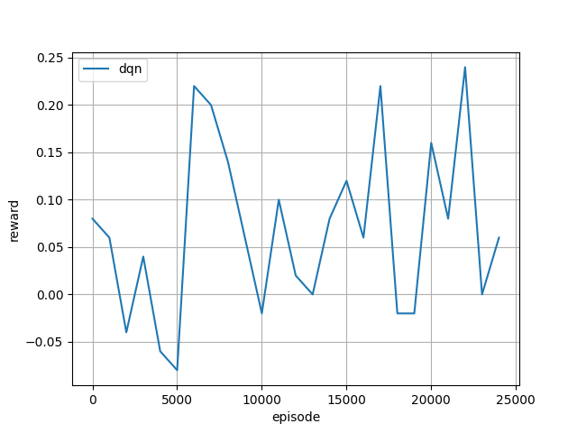

# Milestone 4: Upgrading the Reward System
You can find the Juptyer Notebook for this milestone [here](https://github.com/nicholaslambs/cse151a_project/blob/main/rl_card/rl_card.ipynb).

## Training the Model

Similar to the second milestone, we continued to use the DQN (Deep Q Network) model. We used the same parameters as the second milestone, but we trained the model for 25,000 episodes and then evaluated the model on a simulated Uno environment. For reference, the parameters are as follows:
```python 
agent = DQNAgent(
                 num_actions=env.num_actions,
                 state_shape=env.state_shape[0],
                 mlp_layers=[64,64],
                 replay_memory_size=5000,
                 update_target_estimator_every=100,
                 epsilon_decay_steps=10000,
                 learning_rate=0.0005,
                 batch_size=32,
                 device=device,
                 save_path=log_dir,
                 )
```
A Deep Q Network (DQN) is a reinforcement learning algorithm that uses a neural network to approximate the Q-value function. The Q-value function is a function that takes the state and action as input and returns the expected future rewards for that action. The Q-value function is used to select the best action to take in a given state. In the context of the Uno game, the Q-value function is used to select the best card to play in a given game state.

We evaluated the agent every 1000 episodes for 100 evaluation games and logged the average reward from the tournament simulation.

The environment had 2 players, and the model was trained to play against a random agent. A random agent is an agent that randomly selects a move from the available legal moves.

### Static Rewards on Actions
First, we wanted to include action cards (i.e. special moves like "skip" or "draw 2" or "wild card", etc.) as part of the reward system. From this, we trained an initial model to gain increased rewards by playing these special cards. We used the encoded action cards to distinguish how much reward the agent gains from specific special action cards. For example, the agent gains more rewards by playing a "draw 2" card than a "skip" card.

More specifically, we adjusted the reward system to include the following:
```python
for state, action, reward, next_state, done in traj:
    if action == 60:  # Draw a card
        reward -= 1  # Penalty for drawing a card

    elif action >= 0 and action <= 9:  # Red number cards
        reward += 1
    elif action >= 10 and action <= 12:  # Red action cards
        reward += 3
    elif action == 13:  # Red wild card
        reward += 6
    elif action == 14:  # Red wild and draw 4 card
        reward += 10

    elif action >= 15 and action <= 24:  # Green number cards
        reward += 1
    elif action >= 25 and action <= 27:  # Green action cards
        reward += 3
    elif action == 28:  # Green wild card
        reward += 6
    elif action == 29:  # Green wild and draw 4 card
        reward += 10

    elif action >= 30 and action <= 39:  # Blue number cards
        reward += 1
    elif action >= 40 and action <= 42:  # Blue action cards
        reward += 3
    elif action == 43:  # Blue wild card
        reward += 6
    elif action == 44:  # Blue wild and draw 4 card
        reward += 10

    elif action >= 45 and action <= 54:  # Yellow number cards
        reward += 1
    elif action >= 55 and action <= 57:  # Yellow action cards
        reward += 3
    elif action == 58:  # Yellow wild card
        reward += 6
    elif action == 59:  # Yellow wild and draw 4 card
        reward += 10
```

As you can see, we adjusted the reward system to give the agent more rewards for playing special action cards. More specifically, the reward system was adjusted as follows:
- for playing a normal card move, small positive reward (+1)
- for drawing a card, small negative reward (-1)
- for playing a special action card, a larger positive reward (ranging from +3 to +10)
- winning the game, a large positive reward (+100)
- losing the game, a large negative reward (-25)

### Dynamic Rewards on Actions
After analyzing the trained model a little more, we decided that to increase the complexity of this upgrade by considering the number of cards in the hand as part of the reward system. We trained a second model to gain a dynamic amount of rewards based on the number of cards in the agent's hand and in the opponent's hand. For example, the agent loses more rewards if it draws a card when it has less cards in its hand, and gains more rewards if it plays a card when it has more cards in its hand. Furthermore, the agents gains more rewards by playing special action cards when the opponent has less cards in its hand. 

More specifically, we adjusted the reward system to include the following:
```python
# Actual game state details
raw_obs = state['raw_obs']

# Retrieve the number of cards in player's hand
num_cards_player = len(raw_obs['hand'])

# Provide the number of cards for each player with the current player being index 0
num_cards_opponent = raw_obs['num_cards'][1] if raw_obs['current_player'] == 0 else raw_obs['num_cards'][0]

if action == 60:  # Draw a card
    reward -= max(1, 3 - num_cards_player / 7)

# Adjust rewards for action cards based on the opponent's hand size
action_card_reward_multiplier = max(1, (7 - num_cards_opponent) / 7)

if action in range(10, 15) or action in range(25, 30) or action in range(40, 45) or action in range(55, 60):
    reward += 2 * action_card_reward_multiplier

if action in range(0, 10) or action in range(15, 25) or action in range(30, 40) or action in range(45, 55):
    reward += 1 + (3 - num_cards_player / 7)
```

As you can see, we adjusted the reward system to give the agent a dynamic set of rewards, depending on the state of the game. More specifically, the reward system was adjusted as follows:
- for playing a normal card move, small positive reward (+1) with a dynamic reward based on the number of cards in the agent's hand
- for drawing a card, small negative reward (-1) with a dynamic reward based on the number of cards in the agent's hand
- for playing a special action card, a larger positive reward (ranging from +2 to +10) with a dynamic reward based on the number of cards in the opponent's hand
- winning the game, a large positive reward (+100)
- losing the game, a large negative reward (-25)

## Evaluating the Data
Evaluate your data, labels and loss function. Were they sufficient or did you have have to change them.

In this milestone, our group decided to train two additional models by upgrading the reward system. We wanted to see how the agent would perform with a more complex reward system. We decided to train two models with different reward systems and compare their performance to the initial model. For reference, the initial model was trained with a simple reward system that only gave a small reward on playing a card, small penalty on drawing a card, a large reward on winning the game, and a large (but smaller than winning) penalty on losing the game. The initial model did not seem very effective. Consequently, we wanted to see if a more complex reward system would train the model to play better moves. We could see how the average reward changes with the different reward systems and gauge how the reward system affects the model's performance.

### Data of Static Rewards
Here is the data plotted from the tournament simulation: 



### Data of Dynamic Rewards
Here is the data plotted from the tournament simulation:


## Model Evaluation
From the static rewards model, we can see that the model has some upward trend in the average reward. This suggests that the model was able to win more games and lose less games than the initial model. This suggests that the more complex reward system was able to train the model to play better moves than the simple reward system. However, it still dips into negative rewards, which suggests that the model is still not learning as much as we would like it to.

From the dynamic rewards model, we can see that the model also has an upward trend in the average reward. This continues to address that adding complexity to the reward system is beneficial to the model's performance. Additionally, it never dips into negative rewards which may suggest that the model is learning more effectively than the static rewards model; however, it does drop to 0 rewards, which suggests that the model is still not performing as well as we would like it to. We can see that the model has a max of 0.38 average reward, which is better than the static rewards model! This is good, however it is not consistent enough to be satisfied with the model's performance.

Overall, we want to continue to train the model with a more complex reward system to see if we can improve the model's performance. In the context of an RL model, it is difficult to be confident if a model is underfitting or overfitting. We believe that the model is underfitting because the model is not learning as much as we would like it to. We believe that the model can be improved by training it on more episodes and by adjusting the reward system. This would allow the model to learn on a longer time scale and also increase the amount of knowledge the agent has over the game.

### Parameters
Our model used the same parameters as the first model. We did not perform hyper parameter tuning or K-fold cross validation because we don't think it would be necessary for a reinforcement learning model. We did not perform feature expansion because the RL Card library already provides the necessary features for the model. Instead, we focused on adjusting the reward system to better train the model and improve its performance by gauging how the average reward changes with the different reward systems.

## Moving Forward
For our next model, we want to further increase the complexity of the reward system. We are considering the following additions to the reward system:
- considering the size of the draw pile
- consider the cards that have been played in the game
- distinguish different types of special action cards (i.e. "draw 2" vs "wild card") instead of bunching them together
- try to add some context to the reward system (e.g. if the agent is close to winning, give it a larger reward for playing a card)
- incentivize the agent to accelerate reaching the end of the game (i.e. increase rewards that can conclusively lead to winning)

Additionally, we may adjust the parameters of the DQN model to see how it affects the model's performance on the same reward systems as before. From this, we can try to gauge how the reward system and the model's parameters interact with each other; we can then see which parameters are more important to the model's performance and change them accordingly.

## Conclusions
The second model was trained with a more complex reward system than the first model. We trained two additional models with different reward systems and compared their performance to the initial model. We found that these two models performed better than the first model and the dynamic reward system seemed to perform better than the static one. These two models were able to achieve a more consistent average reward growth over the span of time. This suggests that the more complex reward system was able to train the model to play better moves than the simple reward system.