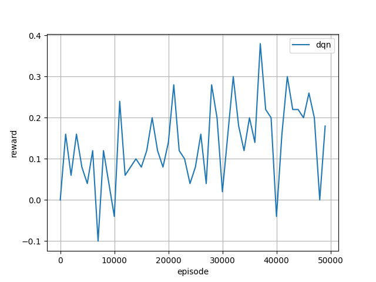

# Final Submission: Reinforcement Learning in Uno


## Introduction
The card game Uno, while appearing simplistic in nature, instead offers a rich oppurtunity for strategic gameplay and quick decision making. This project aims to understand these aspects by developing a Reinforcement Learning (RL) agent capable of mastering Uno. 

Unlike more deterministic games, Uno's unpredictable nature, retrieved from its draw mechanics and the variety of action cards, requires an RL agent to develop strategies that can adapt to rapidly changing game states and opponent behaviors. This task is not just a challenge; it's a feature that makes the task compelling. The project's coolness factor lies in the endeavor to teach a machine how to navigate a game that combines luck and strategy to win.

## Methods
For our RL agent, we decided to use a Q-Learning approach. This method focuses on learning the value of taking a specific action in a given state, aiming to maximize the total reward over time. 

This methodology is particularly suited to Uno, where the game's state changes dynamically with each turn, and the agent must decide from a finite set of possible actions—ranging from playing a card to drawing from the deck—based on the current state of the game.

Our method involves training a deep neural network to estimate the expected rewards for taking each possible action within a given state. As the agent plays more games and receives feedback in the form of rewards, we use this data to update the network, improving its predictions about the game's outcome. This process is facilitated by the DQN algorithm's ability to balance exploration of new strategies with the exploitation of known actions. The state representation for the neural network includes detailed features of the game, such as the agent's current hand, the top card of the discard pile and opponents' hand size providing a comprehensive view of the game's context.

In particular, we used RL Card library to obtain and simulate the Uno environment, as well as training our DQN (Deep Q Network). You can find their documentation about Uno [here](https://rlcard.org/games.html#uno). 

### Data Exploration
Due to the nature of our task, our data would not be accessible through online resources or already gathered data. For this reason, we had to gather retrieve our own data by running through thousands of simulation, and feeding the agent with the data from playing against other agents. Thus, we pitted 3 'random' agents against each other to observe how many turns a typical random agent would take to win the game, and retrieved the following results:


From this data, we can see that most of these Uno games end in around 25-50 games (when playing against a relatively small number of players). For this reason, we can observe that the RL agent can use this information to learn several things:

- adjust the reward function by winning in fewer turns
- understanding the common trend of where a player might win
- judging the RL agent based on the distribution of turns (i.e reward the agent more if they win really early, and less if it takes longer).

Similarly, we can also observe the expected number of action types that a typical Uno agent would do, as seen in the following bar chart:


It can be seen that drawing cards has the highest action count for random agents, so we instinctly knew to penalize the card draw action. Furthermore, we expect our RL agent to have a better distribution with respect to how many cards it draws - especially when it doesn't need to!

### Preprocessing
As mentioned earlier, the data that we're using is the Uno game environment itself. Because of this, we did not have to clean the data, but we did have to filter it to make it more manageable. Thus, we filtered the data to only include the necessary information for the model to make decisions. Thanks to the RL Card library, the environment was structured in a way that is easy to work with. The RL Card library represents the states of the game in a multi-dimensional matrix (i.e. a 4x15 matrix for color and card type representation). More specifically:
- the current player's hand
- the discard pile's top card (target)
- the cards that have been played in the game
- a summary of what's known about the other players' hands

The states are encoded into seven feature planes (each plane is 4x15). This following details are provided from the RL Card library:
> The size of each plane is 4*15. Row number 4 means four colors. 
> Column number 15 means 10 number cards from 0 to 9 and 5 special cards—“Wild”, “Wild Draw Four”, “Skip”, “Draw Two”, and “Reverse”.
> Each entry of a plane can be either 1 or 0. 

In terms of the action space defined by the RLCard environment, each action is assigned an integer, representing the following:
 - 0-9, 10-12: Red number cards, Red action cards
 - 13: Red wild card
 - 14: Red Draw 4
 - 15-24, 25-27: Green number cards, Green action cards
 - 28: Green wild card
 - 29: Green draw 4
 - 30-39, 40-42: Blue number cards, Blue action cards
 - 43 Blue wild card
 - 44 Blue draw 4
 - 45-54, 55-57: Yellow number cards, Yellow action cards
 - 58: Yellow wild card
 - 59: Yellow draw 4
 - 60: Draw a card
   
The processing of this data (i.e. the state representation) is done by the RL Card library, so we did not have to do any additional processing. Our job is primarily to adjust the reward system to better train the model from the default system (i.e. +1 for winning, -1 for losing).

### Model 1
For our first model, we used a DQN with a multilayer perceptron consisting of two layers containing 64 hidden units, a learning rate of 0.0005 and a batch size of 32. This is reflected in our model initialization:

```python 
agent = DQNAgent(
                 num_actions=env.num_actions,
                 state_shape=env.state_shape[0],
                 mlp_layers=[64,64],
                 replay_memory_size=5000,
                 update_target_estimator_every=100,
                 epsilon_decay_steps=10000,
                 learning_rate=0.0005,
                 batch_size=32,
                 device=get_device(),
                 save_path=log_dir
                 )
```

Furthermore, we decided to use a simple reward function as follows:
```python
def adjust_rewards(trajectories, payoffs):
    adjusted_trajectories = []
    for traj in trajectories:
        adjusted_traj = []
        for state, action, reward, next_state, done in traj:
            if action == 60:  # draw a card
                reward -= 1  # Penalty for drawing a card
                
            # Add more conditions for other strategic rewards
            # increment reward for actions 0-9, play red cards
            elif 0 <= action <= 9:
                reward += 1
            # increment reward for actions 15-24, play green cards
            elif 15 <= action <= 24:
                reward += 1
            # increment reward for actions 30-39, play blue cards
            elif 30 <= action <= 39:
                reward += 1
            # increment reward for actions 45-54, play yellow cards
            elif 45 <= action <= 54:
                reward += 1
                        
            adjusted_traj.append((state, action, reward, next_state, done))
        adjusted_trajectories.append(adjusted_traj)
    return adjusted_trajectories
```
As seen above, this simplistic reward function rewards the agent only when it does a good legal action (i.e play any card, as long as it does not draw a card). 
Finally, our training loop consisted of playing the RL agent against a random agent in the Uno environment, adjusting the trajectories of our model with respect to the reward fuction. This is seen as follows: 
```python
episode_num = 25000  # Number of episodes 

evaluate_every = 1000 # Evaluate the agent every X episodes
evaluate_num = 100  # Number of games played in evaluation

with Logger(log_dir) as logger:
    for episode in tqdm(range(episode_num)):  # Number of episodes

        trajectories, payoffs = env.run(is_training=True)

        # Assuming 'payoffs' are the game outcomes for each player
        for i, payoff in enumerate(payoffs):
            if payoff > 0:  # Assuming a positive payoff means winning
                payoffs[i] = 100
            else:
                payoffs[i] = -25

        trajectories = reorganize(trajectories, payoffs)

        # After reorganizing the trajectories, adjust the rewards
        trajectories = adjust_rewards(trajectories, payoffs)
        # print(trajectories[0])

        for ts in trajectories[0]:
            block()
            agent.feed(ts)
            unblock()
        
        if episode % evaluate_every == 0:
                logger.log_performance(
                    episode,
                    tournament(
                        env,
                        evaluate_num,
                    )[0]
                )
```

This training loop remained consistent throughout all 3 models trained. 
The notebook containing this first implementation can be found [here](../ms3/rl_card_ms3.ipynb).

### Model 2
#### Model 2.1
For our second model, we wanted to focus on improving our reward system and see its impact without altering the architecture of the agent too much. So we used the same model as in __Model 1__, but changed the reward function as follows:

```python
for state, action, reward, next_state, done in traj:
    if action == 60:  # Draw a card
        reward -= 1  # Penalty for drawing a card

    elif action >= 0 and action <= 9:  # Red number cards
        reward += 1
    elif action >= 10 and action <= 12:  # Red action cards
        reward += 3
    elif action == 13:  # Red wild card
        reward += 6
    elif action == 14:  # Red wild and draw 4 card
        reward += 10

    elif action >= 15 and action <= 24:  # Green number cards
        reward += 1
    elif action >= 25 and action <= 27:  # Green action cards
        reward += 3
    elif action == 28:  # Green wild card
        reward += 6
    elif action == 29:  # Green wild and draw 4 card
        reward += 10

    elif action >= 30 and action <= 39:  # Blue number cards
        reward += 1
    elif action >= 40 and action <= 42:  # Blue action cards
        reward += 3
    elif action == 43:  # Blue wild card
        reward += 6
    elif action == 44:  # Blue wild and draw 4 card
        reward += 10

    elif action >= 45 and action <= 54:  # Yellow number cards
        reward += 1
    elif action >= 55 and action <= 57:  # Yellow action cards
        reward += 3
    elif action == 58:  # Yellow wild card
        reward += 6
    elif action == 59:  # Yellow wild and draw 4 card
        reward += 10
```

As you can see, we adjusted the reward system to give the agent more rewards for playing special action cards. More specifically, the reward system was adjusted as follows:
- for playing a normal card move, small positive reward (+1)
- for drawing a card, small negative reward (-1)
- for playing a special action card, a larger positive reward (ranging from +3 to +10)
- winning the game, a large positive reward (+100)
- losing the game, a large negative reward (-25)

Furthermore, we added some complexity to the model by looking beyond playing certain types of cards and focusing on the state of the game (i.e the number of cards the opponet has) as seen below:

#### Model 2.2

```python
# Actual game state details
raw_obs = state['raw_obs']

# Retrieve the number of cards in player's hand
num_cards_player = len(raw_obs['hand'])

# Provide the number of cards for each player with the current player being index 0
num_cards_opponent = raw_obs['num_cards'][1] if raw_obs['current_player'] == 0 else raw_obs['num_cards'][0]

if action == 60:  # Draw a card
    reward -= max(1, 3 - num_cards_player / 7)

# Adjust rewards for action cards based on the opponent's hand size
action_card_reward_multiplier = max(1, (7 - num_cards_opponent) / 7)

if action in range(10, 15) or action in range(25, 30) or action in range(40, 45) or action in range(55, 60):
    reward += 2 * action_card_reward_multiplier

if action in range(0, 10) or action in range(15, 25) or action in range(30, 40) or action in range(45, 55):
    reward += 1 + (3 - num_cards_player / 7)
```

As you can see, we adjusted the reward system to give the agent a dynamic set of rewards, depending on the state of the game. More specifically, the reward system was adjusted as follows:
- for playing a normal card move, small positive reward (+1) with a dynamic reward based on the number of cards in the agent's hand
- for drawing a card, small negative reward (-1) with a dynamic reward based on the number of cards in the agent's hand
- for playing a special action card, a larger positive reward (ranging from +2 to +10) with a dynamic reward based on the number of cards in the opponent's hand
- winning the game, a large positive reward (+100)
- losing the game, a large negative reward (-25)

The notebook containing these changes can be found [here](../ms4/rl_card_ms4.ipynb).

### Model 3
For our final model, we created multiple models to get a better understanding of the impact of the reward system and the model architecture. We indicate the different models by __Model 3.1__ and __Model 3.2__. 

```python

#### Model 3.1
In this final model implementation, we varied the DQN architecture slightly by changing the number of hidden units in the multilayer perceptron to 128, as well as a larger learning rate of 0.001. Thus, our new DQN agent was initialized as follows:
```python 
agent = DQNAgent(
                 num_actions=env.num_actions,
                 state_shape=env.state_shape[0],
                 mlp_layers=[128,128], # Changed from 64
                 replay_memory_size=5000,
                 update_target_estimator_every=100,
                 epsilon_decay_steps=10000,
                 learning_rate=0.001, # Changed from 0.0005
                 batch_size=32,
                 device=get_device(),
                 save_path=log_dir
                 )
```

Furthermore, we adjusted the reward function slightly to incorporate a winning factor by incentivizing the agent to accelerate reaching the end of the game (i.e increase rewards that can conclusively lead to winning). This is seen here:

```python
def adjust_rewards(trajectories, payoffs):
    adjusted_trajectories = []
    for traj in trajectories:
        adjusted_traj = []
        for state, action, reward, next_state, done in traj:
            # Actual game state details
            raw_obs = state['raw_obs']
            
            # Retrieve the number of cards in player's hand
            num_cards_player = len(raw_obs['hand'])
            
            # Provide the number of cards for each player with the current player being index 0
            num_cards_opponent = raw_obs['num_cards'][1] if raw_obs['current_player'] == 0 else raw_obs['num_cards'][0]
            
            # A larger reward if the agent has fewer cards
            winning_factor = (7 - num_cards_player) / 7

            if action == 60:  # Draw a card
                reward -= max(1, 3 - num_cards_player / 7)

            # Adjust rewards for action cards based on the opponent's hand size
            action_card_reward_multiplier = max(1, (7 - num_cards_opponent) / 7)

            if action in range(10, 15) or action in range(25, 30) or action in range(40, 45) or action in range(55, 60):
                reward += 2 * action_card_reward_multiplier * winning_factor

            if action in range(0, 10) or action in range(15, 25) or action in range(30, 40) or action in range(45, 55):
                reward += 1 + (3 - num_cards_player / 7) * winning_factor
                
            if num_cards_player <=2:
                reward +=5

            adjusted_traj.append((state, action, reward, next_state, done))
        adjusted_trajectories.append(adjusted_traj)
    return adjusted_trajectories
```

The notebook containing these changes can be found [here](../ms5/models/rl_card_ms5_model1.ipynb).

#### Model 3.2
In this final model implementation, we changed the following parameters in the DQN architecture:
- the replay memory size to 10,000
- the epislon decay steps is 10,000
- the learning rate is 0.00005
- the batch size is 64
- the number of hidden units in the multilayer perceptron to 128

```python
# Default parameters for Deep-Q learning Agent
replay_memory_size = 5000
epsilon_decay_steps = 10000
learning_rate = 0.0005
batch_size = 32
mlp_layers = [128, 128]

# Adjusting parameters to see how it affects the learning curve
replay_memory_size = replay_memory_size * 2
epsilon_decay_steps = epsilon_decay_steps
learning_rate = learning_rate / 10
batch_size = batch_size * 2
mlp_layers = mlp_layers * 1
```

Furthermore, we adjusted the reward function slightly to incorporate a winning factor by incentivizing the agent to accelerate reaching the end of the game (i.e increase rewards that can conclusively lead to winning). Additionally, the agent gets additional rewards by making the opponent draw cards which grows depending on how mnay cards the opponent has. Also, the agent is incentivized to hold wild cards as their last card so they can immediately win when given the opportunity; however, they gain less reward depending on the size of the opponent so the model doesn't necessarily hold onto wild cards all the time. This is seen here:

```python
def adjust_rewards(trajectories, payoffs):
    adjusted_trajectories = []
    for traj in trajectories:
        adjusted_traj = []
        for state, action, reward, next_state, done in traj:
            # Actual game state details
            raw_obs = state['raw_obs']
            
            # Retrieve the number of cards in player's hand
            num_cards_player = len(raw_obs['hand'])
            
            # Provide the number of cards for each player with the current player being index 0
            num_cards_opponent = raw_obs['num_cards'][1] if raw_obs['current_player'] == 0 else raw_obs['num_cards'][0]

            # Adjust rewards for action cards based on the opponent's hand size
            action_card_reward_multiplier = max(1, (7 - num_cards_opponent) / 7)

            # Multiplier to give larger reward if the agent has fewer cards
            winning_factor = (7 - num_cards_player) / 7 

            if action == 60:  # Draw a card
                reward -= max(1, 3 - num_cards_player / 7)

            # Reward for playing action cards 
            if action in range(10, 15) or action in range(25, 30) or action in range(40, 45) or action in range(55, 60):
                reward += 2 * action_card_reward_multiplier * winning_factor

            # On top of the previous reward, add extra for playing action cards that makes the opponent draw cards
            if action in [12, 14, 27, 29, 42, 44, 57, 59]:
                reward += 2 * action_card_reward_multiplier * winning_factor

            # If there's only one card left in agent's hand, add big reward because it's very likely to win if it saves the wild card for the last
            if num_cards_player == 1 and action in [13, 14, 28, 29, 43, 44, 58, 59]:
                # However, we don't want to encourage the agent to save the wild card if the opponent has a small hand so we divide the reward
                reward += 25 / action_card_reward_multiplier

            # Smaller reward for playing normal cards, adjusted based on the number of cards in the player's hand
            if action in range(0, 10) or action in range(15, 25) or action in range(30, 40) or action in range(45, 55):
                reward += 1 + (3 - num_cards_player / 7) * winning_factor

            # Incentivize the agent to have fewer cards in hand
            if (num_cards_player < num_cards_opponent):
                reward += 1 * winning_factor

            adjusted_traj.append((state, action, reward, next_state, done))
        adjusted_trajectories.append(adjusted_traj)
    return adjusted_trajectories
```

The notebook containing these changes can be found [here](../ms5/models/rl_card_ms5_model2.ipynb).

## Results
### Model 1

__Random Agent__:


From this, we can see that a random agent has a very unpredictable reward system. This is expected as the agent is not learning from any previous experiences. The reward system is very noisy and averages out around 0 which implies that it wins and loses games at a similar rate.

__RL Agent__ at 10,000 episodes:


__RL Agent__ at 50,000 episodes:


With our basic implementation of a reward system, we can see that the agent seems to grow in performance over time. The agent's reward system is less noisy and seems to be increasing over time. This implies that the agent is learning from its previous experiences and is able to win more games as it plays more games. It has a higher positive output than the random agent.

### Model 2
#### Model 2.1
__Improved Reward System__ at 25,000 episodes:


From this, we can see that the improved reward system has a more consistent reward system. The agent's reward system is less noisy and seems to be increasing even more over time, compared to model 1.

#### Model 2.2
__Dynamic Reward System__ at 25,000 episodes:


From this, we can see that the dynamic reward system performs similarly to the static reward system. However, the dynamic reward system still performs slightly better and even peaks higher than the static reward system.

### Model 3
__Tweaking DQN parameters__ at 25,000 episodes:


We decided to tweak around some parameters to see how it affects the agent's performance. The *first* graph shows what happens to the performance if we were to adjust all the parameters by a factor of 2 from their original values. The *second* graph shows what happens to the performance if we were to adjust the learning rate by dividing it by 10 (making it smaller). We can see that the agent's performance is still increasing over time and changing the learning rate impacts the performance slightly. We can see that making the learning rate larger makes the agent perform roughly the same, but making the learning rate smaller makes the agent perform slightly worse at first and then better later on.

#### Model 3.1


From this, we can see that the agent's performance is increasing more rapidly than the previous models. The agent's reward system seems to be winning more likely and gaining more rewards over time. This implies that the agent is learning from its previous experiences and is able to win more games as it plays more games. It has a higher positive output than the previous models.

#### Model 3.2

__Lower Learning Rate__ at 50,000 episodes:


From this, we can see that the agent's performance is more controlled and less noisy than the previous models. The agent's reward system seems to be making better decisions than the previous models (i.e. higher reward output). The results are more consistent and higher which implies that the agent is learning better compared to previous models from a more complex reward system.

__Higher Learning Rate__ at 50,000 episodes:


From this, we can see that a higher learning rate makes the agent perform worse. The performance is still better than previous models (i.e. from model 1 and 2), but still performs worse than the lower learning rate model. 

## Discussion
### Model 1
The first model was a good starting point for our project. We were able to see that the agent performed differently than a random agent. The data of the DQN agent had less noise which shows that it was learning from its previous experiences. However, the reward output was still quite low so we knew there was something going wrong with the agent. We decided that the reward system should be improved upon to better incentivize the agent to make strategic moves. Thus, moving forward onto model 2, we had a goal in mind to improve the reward system.

### Model 2
#### Model 2.1
The second model was a good improvement from the first model. We were able to see that the improved reward system was able to capture the nuances of the game and incentivize the agent to make strategic moves. This is likely why the agent's performance was higher than the first model. However, the agent's performance was still not as high as we would have liked. Similar to model 1, we wanted to add even more complexity to the model to see if it would improve the agent's performance.

#### Model 2.2
To add more complexity to the model's reward system, we decided to make the rewards more dynamic by considering the size of the agent's hand and opponent's hand. This was done to incentivize the agent to make strategic moves that would lead to winning the game. The results showed that the dynamic reward system performed slightly better than the static reward system. This implies that adding complexity to the model's reward system does heavily impact the agent's performance. Thus moving forward, we wanted to continue changing the reward system by considering more strategies and different reward point allocation systems.

### Model 3
On top of changing the reward system, we also wanted to see how the DQN parameters would affect the agent's performance. We decided to tweak around some parameters to see how it affects the agent's performance. The results showed that the agent's performance is still increasing over time and changing the learning rate impacts the performance slightly. By tweaking the archiecture's parameters, we can see a slight improvement to the agent's performance by increasing most of the parameters. However, this led to slower processing which implies more resources were required to train the model. 

#### Model 3.1
The third model was a good improvement from the previous models. We were able to see that the agent's performance was increasing more rapidly than the previous models. By incentivizing the agent to decrease their hand size and use special action cards more strategically, we can see a good improvement to the agent's reward output. The agent's reward system seems to be winning more likely and gaining more rewards over time. This further confirms our hypothesis that the reward system will heavily impact the agent's performance. 

#### Model 3.2
This model was very similar to model 3.1, with some slight modifications and complexity added to the reward system. 

We can see that the reward system here is also performing better than model 3.1 (thus better than all the other models as well). Again, this implies that the reward system is heavily impacting the agent's performance. By incentivizing the agent to make strategic moves that would lead to winning the game. The agent's reward system seems to be making better decisions than the previous models (i.e. higher reward output). The results are more consistent and higher which implies that the agent is learning better compared to previous models from a more complex reward system.

We can also see that the slower learning rate models perform better than the higher learning rate models because there is less noise in the reward system. By having a slower learning rate, the agent is able to make better decisions which leads to a higher reward output. However, the difference in performance is not too significant for 50K episodes, but might be more impactful or relevant when training for a longer period of time (i.e. more episodes).

## Conclusion
In conclusion, this project focused on training a reinforcement learning model to win the card game, Uno. We experimented with different reward systems improve the model's performance. The reward system was adjusted to incentivize the agent to make moves that could lead to winning the game, such as playing special action cards and maintaining a smaller hand size.

We also experimented with different model architectures, such as changing the number of hidden units in the multilayer perceptron and adjusting the learning rate. These changes were made in an attempt to improve the model's learning efficiency and overall performance.

However, despite these adjustments, the model's performance still has room for improvement. The data from the tournament simulations showed that while the model was able to win more games and lose fewer games than the initial model, it still occasionally dipped into negative rewards. This suggests that the model is not learning as effectively as desired.

Moving forward, further optimization of the reward system and tweaking of the model parameters could potentially lead to a better learning model. By continuing to refine the reward system and adjust the model parameters, it may be possible to train a model that can consistently achieve a higher win rate. This project serves as a valuable exploration into the application of reinforcement learning in game-playing scenarios, and the lessons learned can be applied to future projects and research.

## Collaboration
All group mates contributed to the project. We would meet throughout the weeks to get an idea how to move forward with the project. The following is a list of their contributions:
- Nicholas Lam
    - Invested time to research into the RL Card library and how to use it
    - Wrote the initial code for the first and second models and finished gathering the data on those models
    - Contributed to the second version of the third model
    - Gathered data for the second version of the third model
    - Contributed to the reports for all milestones.
- Hariz Megat Zariman
    - Contributed to how to optimize the reward system
    - Contributed to the first version of the third model
    - Contributed to the reports for all milestones.
- Jaehoon Kim
    - Contributed to how to optimize the reward system
    - Invested resources to learning more about RL and the concepts related to it + the project
    - Contributed to the reports for all milestones.
